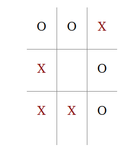

# Details:
This is a project build to make an A.I. bot that playss tic-tac-toe against its enemies using a Game Tree for making the best long term decisive move (note:I'm not using the Min-Max algorithms point system; I'm just having fun)

